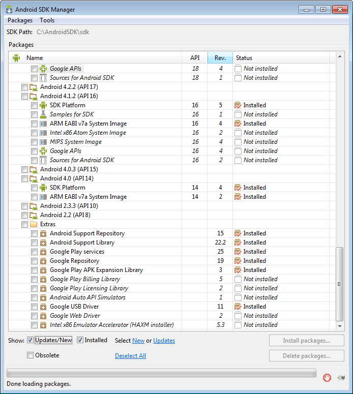
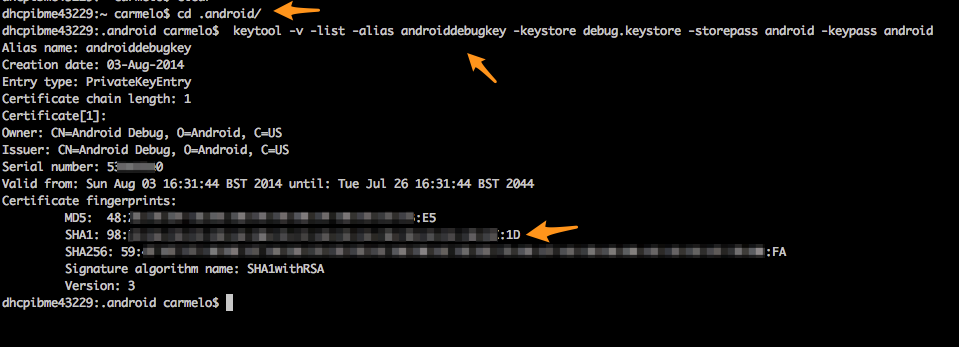

#INTRO
This project contains a Cordova plugin for the GoogleFit platform.
Any pull request considered ;)

If you seek a plugin that can 'talk' to both Android and iOS please check [this work](https://github.com/dariosalvi78/cordova-plugin-health) done by a colleague of mine.
It also operates with HealthKit, which makes it less GoogleFit oriented... but more Cordova style!


## Caveats
The plugin is still in development and is provided "AS IS".
It works only to read certain data from the GoogleFit API and is not yet ready to store any data.


##Content
Here the breakdown of the content

- plugin.xml  (The Manifest file for the plugin)
- src/
   - android/
      - <Java source code>  (The native Android Java code)
- www/
   - <JavaScript interface> (The connector code)


## Using the plugin

You can install the plugin by using the cordova npm repository.

```
cordova plugin add org.velardo.cordova-plugin-googlefit
```

To use the plugin you need to call the specific functions

```
window.plugins.googlefit.getStuff1(
                  1435708800000,    // Start time in milliseconds
                  1436368288000,    // Start time in milliseconds
                  datatypes,        // Datatypes under the URL format specified by GoogleFit
                  function(data) {
                    // Success callback. The data object is a JSON that follows
                    // the structure of GoogleFit data structures
                  },
                  function(e) {
                    // The error e is returned in case of problems with the query
                  });

window.plugins.googlefit.getStuff2(
                  1435708800000,    // Start time in milliseconds
                  1436368288000,    // Start time in milliseconds
                  datatypes,        // Datatypes under the URL format specified by GoogleFit
                  datatypes,        // Datatypes under the URL format specified by GoogleFit
                  1,                // Duration value of the databucket
                  "DAYS",           // TimeUnit that quantify the duration unit (DAYS, HOURS, MINUTES, SECONDS)
                  0,                // Type of the Buckets (0: ByTime, 1: ByActivityType, 2: ByActivitySegment)
                  function(data) {
                    // Success callback. The data object is a JSON that follows
                    // the structure of GoogleFit data structures
                  },
                  function(e) {
                    // The error e is returned in case of problems with the query
                  });
```

Valid DataTypes
------

At the moment the datatypes that are readable from the GoogleFit API are listed below.

Use them by placing the corresponding GoogleFit URL notation in the arrays passed to the GetStuff1 and GetStuff2 JavaScript calls.

| DataType                                | URL format                               |
| --------------------------------------- | ---------------------------------------- |
| DataType.TYPE_STEP_COUNT_DELTA          | com.google.step_count.delta              |
| DataType.AGGREGATE_STEP_COUNT_DELTA     | com.google.step_count.delta              |
| DataType.TYPE_CALORIES_EXPENDED         | com.google.calories.expended             |
| DataType.AGGREGATE_CALORIES_EXPENDED    | com.google.calories.expended             |
| DataType.TYPE_DISTANCE_DELTA            | com.google.distance.delta                |
| DataType.AGGREGATE_DISTANCE_DELTA       | com.google.distance.delta                |
| DataType.TYPE_HEIGHT                    | com.google.height                        |
| DataType.TYPE_ACTIVITY_SAMPLE           | com.google.activity.sample               |
| DataType.TYPE_ACTIVITY_SEGMENT          | com.google.activity.segment              |
| DataType.AGGREGATE_ACTIVITY_SUMMARY     | com.google.activity.summary              |
| DataType.TYPE_WEIGHT                    | com.google.weight                        |
| DataType.TYPE_HEART_RATE_BPM            | com.google.heart_rate.bpm                |
| DataType.TYPE_POWER_SAMPLE              | com.google.power.sample                  |
| DataType.AGGREGATE_POWER_SUMMARY        | com.google.power.summary                 |
| DataType.TYPE_CYCLING_PEDALING_CADENCE  | com.google.cycling.pedaling.cadence      |
| DataType.TYPE_CYCLING_WHEEL_REVOLUTION  | com.google.cycling.wheel_revolution.rpm  |
| DataType.TYPE_LOCATION_SAMPLE           | com.google.location.sample               |


# Test the GoogleFit Cordova plugin

## SDK requirements for compiling the plugin
In order for the plugin to compile you need to install the
```
Android Support Repository
Android Support Library
Google Play services
Google Repository
Google Play APK Expansion Library
```
 


## How to enable the Google Fitness API for your application

In order for your app to communicate properly with the Google Fitness API, you need to provide the SHA1 sum of the certificate used for signing your application to Google. This will enable the GoogleFit plugin to communicate with the Fit application in each smartphone where the application is installed.

To do this:
 * Create a project in the [Google code console](https://code.google.com/apis/console/?pli=1)
 * Search and enable the "Fitness API"
 * Then Credentials → Create new client ID → Installed application
 * If this is the first time you configure the project you should now "Configure the consent screen" where you can add details about your app and then save it for future uses
 * Now go to "installed application" and select Android
 * You need to specify the package name (As in the "config.xml" of the Cordova project, under the id property of <widget>)

 * For the SHA1 signature, go to the folder where you have stored your keystore file and invoke the
  keytool -v -list -alias <PUT_ALIAS_HERE> -keystore <NAME_OF_KEYSTORE_FILE> -storepass <PASSWORD> -keypass <PASSWORD>
    * In case of the default debug key the folder is "".android" in your home directory (both Windows and Linux/Mac users) and Execute:
    ```
    keytool -v -list -alias androiddebugkey -keystore debug.keystore -storepass android -keypass android
    ```
    * If you want to generate your own keystore:
    ```
    keytool -genkey -v -keystore APPNAME.keystore -alias APPNAME -keyalg RSA -keysize 2048 -validity 10000
    ```

 * You can now see the SHA1 signature of the debug keystore like

  

 * Now go back to the API console website, copy the SHA1 signature, press on "create client ID"

 * Now the first time the user accesses the GoogleFit plugin (by calling one of the getStuff* functions), the user will be asked to pair a user account to the google fit. At this stage of development, the first call will be lost, it won't produce any data so be careful!

 * In order to use it in Cordova, put the keystore file in ./platforms/android/ and then add a file named ant.properties in the same folder with these two lines:
    * key.store=APPNAME.keystore
    * key.alias=APPNAME


Online resources for GoogleFit
------

[Data Types](https://developers.google.com/fit/android/data-types)


[Activity Types](https://developers.google.com/fit/rest/v1/reference/activity-types)
